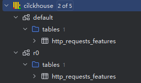

# 发生了什么

可以看[这篇官方博客](https://blog.cloudflare.com/zh-cn/18-november-2025-outage/)。简而言之，因为 cf 更改数据库权限，把一份 “防机器人规则清单” 搞成两倍大，超过程序上限，导致全球服务器集体崩溃，Cloudflare 核心流量处理系统出现大范围 5xx，影响持续近 6 小时。

这次事故值得研究的点在于，它导致了一次级联事故：

```text
数据库权限变化

  -> 元数据查询结果变化

  -> 配置生成器生成异常 feature file

  -> 配置文件被快速分发

  -> worker 加载配置时超过运行时上限

  -> unwrap() 触发 panic

  -> 流量路径异常
```

下面是我做的一个简化实验，用 Docker、ClickHouse、Python 和 Rust 模拟这条链路。

# 基础前备

此实验不需模拟 cf 整套生产环境，只是抓住事故里的几个关键抽象：

* ClickHouse：模拟“元数据可见性变化”
* generator：模拟 feature file 生成器
* distributor：模拟配置分发服务
* worker-1 / worker-2：模拟流量路径上的节点
* 错误配置：模拟异常 feature file 被推送到节点

## ClickHouse

ClickHouse 是一个列式数据库，cf 采取其的原因在于高性能，然而我不关心它的存储性能，只用它来模拟一个现象：**同一条元数据查询，在权限变化前后返回不同数量的列信息**。

Cloudflare 官方复盘里提到，事故中的查询没有限制 database 名称。当底层数据库 `r0` 的元数据也对查询用户可见时，这条查询就不只返回 `default` 里的列，还会把 `r0` 里的同名表列也返回出来，从而产生重复 feature。

## 有关 Rust 的错误处理

从官方博客中也不难看见这行代码：

> .unwrap()

这并不是 Rust 不安全，而是在不该 panic 的生产路径上使用了 `unwrap()`。

尽管我不清楚 cf 为什么写出这么招笑的代码，但值得为后人警醒的是：**在生产环境，不能把可预期的错误直接 panic 掉**。

## 实验链路

1. ClickHouse 中有两个结构相同的表：

   * `default.http_requests_features`
   * `r0.http_requests_features`
2. 权限变化前，查询只返回 `default` 表里的 120 个字段。
3. 权限变化后，查询不再过滤 database，于是同时返回 `default` 和 `r0` 里的字段，结果变成 240 条。
4. generator 把这些字段写成 JSON feature file。
5. worker 每隔 5 秒从 distributor 拉取 feature file。
6. 当 feature 数量超过 200，worker 加载失败并触发 panic。

# 要开始了哟

## 1.数据库搭建

首先我们要把 ClickHouse 跑起来，我用 Docker 容器代替：

```bash
docker run -d --name clickhouse-server -p 8123:8123 -p 9000:9000
```

然后进入容器：

```bash
docker exec -it clickhouse-server clickhouse-client
```

创建用户：

```sql
CREATE USER IF NOT EXISTS lab IDENTIFIED BY '123456';

GRANT SHOW ON *.* TO lab;
GRANT SELECT ON *.* TO lab;
```

接下来我们要使用 ClickHouse 的 Memory 引擎（忽略数据库本身的存储方式）。这里使用 `generate-metadata.sql` 生成所需的 sql 语句：

- 创建名为 r0 的数据库
- 在 default 和 r0 数据库中各创建一个 http_requests_features 表
- 使用 Memory 引擎（数据存储在内存中）
- 两个表的结构完全相同（都有 120 个 UInt8 类型的列）

`generate-metadata.sql`（仅作示意，完整的在仓库里）

```sql
CREATE DATABASE IF NOT EXISTS r0;

CREATE TABLE IF NOT EXISTS default.http_requests_features (
  f001 UInt8,
  f002 UInt8,
  ...
  f119 UInt8,
  f120 UInt8
) ENGINE=Memory;

CREATE TABLE IF NOT EXISTS r0.http_requests_features (
  f001 UInt8,
  f002 UInt8,
  ...
  f119 UInt8,
  f120 UInt8
) ENGINE=Memory;
```

然后就有两个表了：



## 2.模拟权限变更、查询并返回

这里不过多赘述细节的权限分配，只模拟事件。

如果想直观看到返回，可以用数据库管理工具直观查看变化。这里我用 Datagrip，以下面的凭证连接数据库：

- Username: lab
- Password: 123456

执行下面命令：

`check-before.sql`

```sql
SELECT name, type
FROM system.columns
WHERE database = 'default'
  AND table = 'http_requests_features';
```

理想中会先看到只返回 `default` 的 120 列

然后执行 `check-after.sql` ：

```sql
SELECT name, type
FROM system.columns
WHERE table = 'http_requests_features'
ORDER BY name;
```

能发现变成了 240 列。

## 3.写配置生成器

先确保依赖都有：

```bash
pip install -r requirements.txt
```

然后确保 clickhouse 启动的情况下执行 `generator.py`：

```python
import json
import clickhouse_connect

# 读取配置和sql命令
def load_config():
    with open('config.json', 'r') as f:
        return json.load(f)

def load_sql_script(filename):
    with open(filename, 'r') as f:
        return f.read()

# 连接clickhouse
def connect_clickhouse(config):
    ch_config = config['clickhouse']
    client = clickhouse_connect.get_client(
        host=ch_config['host'],
        port=ch_config['port'],
        username=ch_config['user'],
        password=ch_config['password']
    )
    return client

# 查询
def execute_and_fetch_features(client, sql_script):
    """保留原始查询结果，不能用 dict 去重"""
    result = client.query(sql_script)
    features = []
    for row in result.named_results():
        features.append({
            "name": row["name"],
            "type": row["type"]
        })
    return features

def main():
    config = load_config()
    client = connect_clickhouse(config)
    print("✓ 已连接到 ClickHouse")

    print("执行 check-before.sql...")
    check_before_sql = load_sql_script('check-before.sql')
    features_okay = execute_and_fetch_features(client, check_before_sql)
    with open('features-okay.json', 'w', encoding='utf-8') as f:
        json.dump(features_okay, f, indent=2, ensure_ascii=False)
    print(f"(i) 已生成 features-okay.json，条目数: {len(features_okay)}")

    print("执行 check-after.sql...")
    check_after_sql = load_sql_script('check-after.sql')
    features_bad = execute_and_fetch_features(client, check_after_sql)
    with open('features-bad.json', 'w', encoding='utf-8') as f:
        json.dump(features_bad, f, indent=2, ensure_ascii=False)
    print(f"(i) 已生成 features-bad.json，条目数: {len(features_bad)}")

    client.close()
    print("✓ 已断开连接")

if __name__ == '__main__':
    main()
```

此时工作目录下生成 json 配置，统计长度发现：

```bash
guaizai@gz-MacBook-Air cf-outage-repro % jq length features-okay.json
120
guaizai@gz-MacBook-Air cf-outage-repro % jq length features-bad.json
240
```

观察得错误配置确实生成了两倍的条目数。

## rust 模拟抛出 unwrap panic

```cpp
// Worker 服务：
// 定期从 distributor 拉取 `features.json`，并将解析结果写入共享状态。
// 暴露两个 HTTP 接口：`/health`（返回状态与特征数量）和 `/features`（返回当前特征列表）。
// 注：为了重现故障场景，代码在解析或特征数量超限时故意使用 `unwrap()`，会触发 panic。

use serde::{Deserialize, Serialize};
use std::sync::Arc;
use tokio::sync::RwLock;
use axum::{
    Router,
    routing::get,
    Json,
    extract::State,
};
use std::time::Duration;

#[derive(Debug, Clone, Serialize, Deserialize)]
// `Feature` 表示單個特徵項，來自 distributor 返回的 JSON 中每個對象。
// 因為 JSON 字段名中使用了 "type"，在結構體中用 `feature_type` 字段並通過 serde 進行重命名。
struct Feature {
    name: String,
    #[serde(rename = "type")]
    feature_type: String,
}

// 特征最大值，超过此就会故障
const MAX_FEATURES: usize = 200;
// distributor 服务容器内文件名
const DISTRIBUTOR_URL: &str = "http://distributor:8000/features.json";
// 后台刷新间隔
const RELOAD_INTERVAL: Duration = Duration::from_secs(5);

#[derive(Clone)]
struct AppState {
    features: Arc<RwLock<Vec<Feature>>>,
    worker_id: String,
}

// 判断特征是否超过上限
fn validate_feature_count(n: usize) -> Result<(), String> {
    if n > MAX_FEATURES {
        Err(format!("too many features: {n} > {MAX_FEATURES}"))
    } else {
        Ok(())
    }
}

// 校验数量
fn load_features_from_json(content: &str) -> Vec<Feature> {
    // 特征超过200崩掉，触发 panic
    let v: Vec<Feature> = serde_json::from_str(content).unwrap();
    validate_feature_count(v.len()).unwrap(); // 故意保留事故点
    v
}

// 后台循环拉取 distributor 的 features.json，解析后写入共享状态
async fn reload_features(state: AppState) {
    loop {
        tokio::time::sleep(RELOAD_INTERVAL).await;
        
        match reqwest::get(DISTRIBUTOR_URL).await {
            Ok(response) => {
                match response.text().await {
                    Ok(content) => {
                        println!(
                            "[{}] Fetched features.json, size: {} bytes",
                            state.worker_id,
                            content.len()
                        );
                        
                        // 超过200这里会unwrap崩掉
                        let features = load_features_from_json(&content);
                        
                        // 将新特征写入共享状态
                        let mut w = state.features.write().await;
                        *w = features.clone();
                        println!(
                            "[{}] Loaded {} features successfully",
                            state.worker_id,
                            features.len()
                        );
                    }
                    Err(e) => {
                        // 读取响应体失败：记录错误，不中断循环
                        eprintln!("[{}] Failed to read response body: {}", state.worker_id, e);
                    }
                }
            }
            Err(e) => {
                // 请求失败：记录错误，不中断循环
                eprintln!("[{}] Failed to fetch features.json: {}", state.worker_id, e);
            }
        }
    }
}

// 健康检查接口，返回 worker ID、状态、当前特征数量和最大特征限制
async fn health_check(State(state): State<AppState>) -> Json<serde_json::Value> {
    let features = state.features.read().await;
    Json(serde_json::json!({
        "worker_id": state.worker_id,
        "status": "ok",
        "features_count": features.len(),
        "max_features": MAX_FEATURES,
    }))
}

// 特征列表接口，返回当前加载的特征数组
async fn get_features(State(state): State<AppState>) -> Json<Vec<Feature>> {
    let features = state.features.read().await;
    Json(features.clone())
}

#[tokio::main]
// 程序入口
async fn main() {
    tracing_subscriber::fmt::init();
    
    // 从环境变量读取 worker ID 和端口，提供默认值
    let worker_id = std::env::var("WORKER_ID").unwrap_or_else(|_| "worker-1".to_string());
    let port = std::env::var("PORT")
        .unwrap_or_else(|_| "8001".to_string())
        .parse::<u16>()
        .unwrap();
    
    println!("[{}] Starting worker on port {}", worker_id, port);
    
    let state = AppState {
        features: Arc::new(RwLock::new(vec![])),
        worker_id: worker_id.clone(),
    };
    
    // 启动后台任务
    let reload_state = state.clone();
    tokio::spawn(reload_features(reload_state));
    
    // 设置 HTTP 路由，绑定接口和状态
    let app = Router::new()
        .route("/health", get(health_check).with_state(state.clone()))
        .route("/features", get(get_features).with_state(state))
        .into_make_service();
    
    // 启动 HTTP 服务器，监听指定端口
    let listener = tokio::net::TcpListener::bind(format!("0.0.0.0:{}", port))
        .await
        .unwrap();
    
    println!("[{}] Server is running", worker_id);
    
    axum::serve(listener, app).await.unwrap();
}
```

## 手动触发故障

构建 docker 镜像

```bash
docker compose up --build
```

替换坏的配置文件

```bash
cp features-bad.json features.json
```

验证 distributor 可用：

```bash
curl http://localhost:7100/features.json
curl http://localhost:7100/health
```

观察日志可以发现 panic 输出：

```bash
docker compose logs -f worker-1
```

# 反思

实际上配置更精细化的权限没有错，只是，现有云 infra 历经多年的递进关系导致，一旦变更一个小改动，就很有可能触发 n 年前留下的史山——更别提对于现有架构的重构了。尽管如此，Cloudflare 也应该采取灰度或者金丝雀通道推送变更。

所以现有云架构的脆弱性可想而知，在此之前的几次云服务宕机都预示着：idc 们要赔好大一笔了。

# 附

本文用到的所有代码都放仓库里了：[https://github.com/ustmeo-lab/cf-outage-repro](https://github.com/ustmeo-lab/cf-outage-repro)
