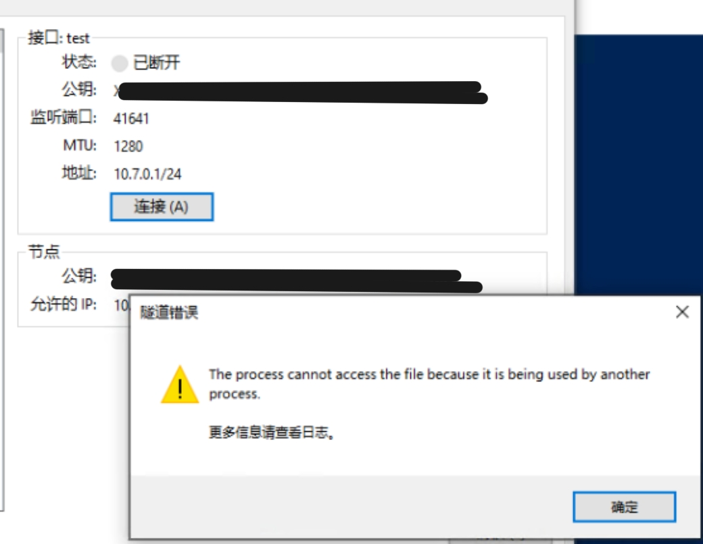
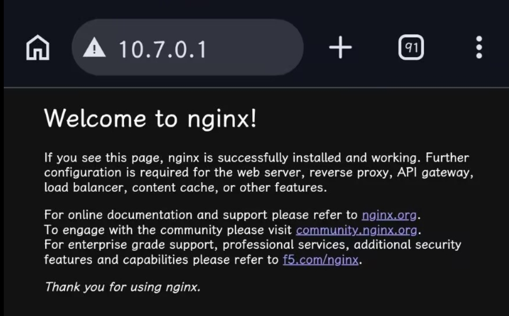
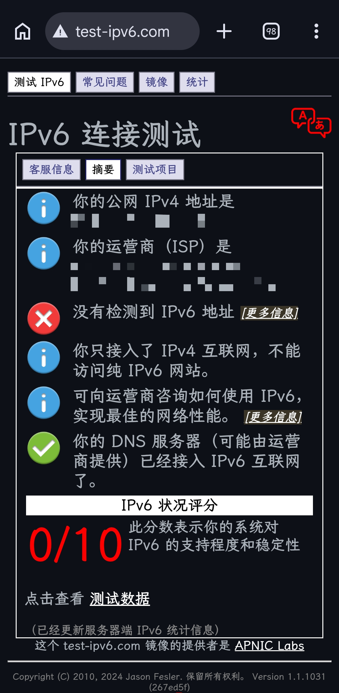
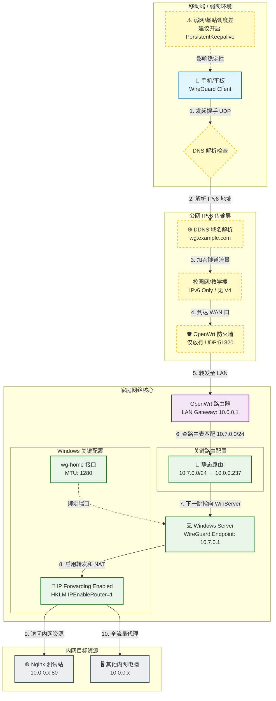

# 需求

随着带出的上网设备变多（其实也就手机和平板），再加之科技不稳定导致频繁更换，我决定即便是公网设备也把所有流量转发到我的家庭网络。

当前的网络环境：宿舍有公网 ipv6，没有 v4，同时屏蔽 80/443 端口。

不过要死的是，对于某些关键端口，数据包会被随机丢失，尤其是 3389、51820 等需要长时间连接并传输数据的（不知是教学楼网太差还是本就如此）。实测更改端口可以缓解很多，但保持这些默认端口的话，我感觉会非常不稳。

# 部署

由于我的软路由性能太弱，因此wg server放在软路由LAN口下的一个Windows主机上。外部网络连接此主机的公网v6地址（通过ddns映射到我的域名）。局域网下产生的流量均由小猫接管并出口，而外部又与局域网建立了wg隧道，从而实现在外也能变成魔法家。

### 在 Server 上配置

安装 Wireguard。

写配置文件示例如下：

```
[Interface]
PrivateKey = <WindowsServer_private_key>
Address = 10.7.0.1/24
ListenPort = 51820
MTU = 1280

[Peer]
PublicKey = <phone_public_key>
AllowedIPs = 10.7.0.2/32
```

配置文件的端口仅作示例，实际部署时，我换到了其它高位端口。

之后，在 Windows 侧开启 ip 转发：

```
Set-NetIPInterface -InterfaceAlias "wg-home"  -AddressFamily IPv4 -Forwarding Enabled
Set-NetIPInterface -InterfaceAlias "Ethernet" -AddressFamily IPv4 -Forwarding Enabled

Set-ItemProperty `
  -Path "HKLM:\SYSTEM\CurrentControlSet\Services\Tcpip\Parameters" `
  -Name IPEnableRouter `
  -Value 1
```

此外，还得对 ipv6 进行 ddns 到我的个人域名，这样 Endpoint 就可以固定住了。

### Openwrt 侧配置

外部设备发来的包能到达 LAN 后，需要让返回包知道 10.7.0.0/24 应该回 Windows Server。

```
uci add network route
uci set network.@route[-1].interface='lan'
uci set network.@route[-1].target='10.7.0.0/24'
uci set network.@route[-1].gateway='10.0.0.237'
uci commit network
/etc/init.d/network reload
```

原本我是开了一大堆端口，配置完后安全起见，就可以只允许 WireGuard 端口进站而关闭其他端口了。

```
uci add firewall rule
uci set firewall.@rule[-1].name='Allow-WireGuard-WindowsServer-IPv6'
uci set firewall.@rule[-1].family='ipv6'
uci set firewall.@rule[-1].src='wan'
uci set firewall.@rule[-1].dest='lan'
uci set firewall.@rule[-1].proto='udp'
uci set firewall.@rule[-1].dest_ip='<WindowsServer公网IPv6>'
uci set firewall.@rule[-1].dest_port='51820'
uci set firewall.@rule[-1].target='ACCEPT'
uci commit firewall
/etc/init.d/firewall reload
```

### 移动端配置

把所有流量进隧道网关：

```
[Interface]
PrivateKey = <client_private_key>
Address = 10.7.0.2/32
DNS = 10.0.0.1
MTU = 1280

[Peer]
PublicKey = <server_public_key>
Endpoint = wg.example.com:51820
AllowedIPs = 0.0.0.0/0
PersistentKeepalive = 25
```

# 踩坑

### 踩坑 1：手机 fakeip 未能成功解析域名

服务端侧日志输出如下：

```
Sending handshake initiation to peer 1 (198.18.20.146:51820)
Handshake did not complete
```

注意到 `198.18.0.0/15` 这个网段是 RFC 2544 定义的“基准测试”专用地址段，同时结合设备软件环境，不难看出，我的 dns 解析被小哈基咪误劫持了。

首先可以做的是，将手机对端改成诸如 `[2409:...]:51820` 的 ipv6 地址。

其次，如果不懒，可以试着将ddns域名假如`fake-ip-filter`。

### 踩坑 2：误在服务端配置也填写对端 point

这个注意点就好了。

### 踩坑 3：服务端 peer 的 AllowIPs 不匹配

根因是我 CIDR 前缀写错了。

日志输出：

```
Packet has unallowed src IP (10.7.0.2) from peer 1
```

总而言之应该注意：

手机 Interface Address = 10.7.0.2/32
服务端 Peer AllowedIPs = 10.7.0.2/32

### 踩坑 4：wireguard 奇怪的进程占用问题



通常是因为 Windows 下的 Wireguard-NT 虚拟网卡驱动假死，或者上一次连接未正常释放。图省事可以更改监听端口，修改接口名也行，想要根治就去 Windows 服务列表里重启 WireGuardTunnel$wg-home 服务，或者在设备管理器删掉隐藏的失效网卡。

——

总之经过一系列操作，可以使用内网 IP 访问我的 nginx 测试站：



然后手机把 AllowIPs 改成 `10.7.0.0/24, 10.0.0.0/24`，表示这两个网段走wireguard。

注意之前踩坑 4，如果网卡名被更改，一定要重新设置数据包转发。

等待测试能访问其他内网电脑（例如 10.0.0.x:80），再把手机 AllowedIPs 改成 0.0.0.0/0，测试全流量回家走哦喷小猫咪。

# 遇到的问题

### 弱网环境下雪上加霜

众所周知，也许是教学楼结构问题，也许是基站调度问题，一旦人多，信号就会奇差无比。

但是，一旦遭遇卡顿，经我实测，关闭隧道后就能恢复网络，因此我严重怀疑弱网加剧了我的设备流量不可达性。

### 校园网连 v6 都没有

一开始我以为是 dns 问题，后来不用域名连接还是连不上，然后，我测了一下，nmd，连不上也难怪了。



# 网络拓扑图
随便找了个AI帮我画了下，我也没细看，反正意思大差不差吧。


# 那该怎么办？
通过上述折腾不难看出：虽然 WireGuard 是一个极其优秀的协议，**但它只适合运行在网络环境相对干净、确定的两端之间。** 像我学校教学楼这种烂网，不套隧道都不太能建立起相对稳定的网络连接，更何况还要开魔法做策略路由，更何况还会遇到QoS，简直雪上加霜。

这个时候不妨尝试DERP机制，代表的有：Tailscale 和 ZeroTier。

不过由于主啵没有稳定的国内服务器作为DERP中继节点，就没有尝试上述方案，敬请期待喵。

# 尾声
这次折腾属实费了我一整个下午，也在课上花费了不少时间来回捣鼓。虽然过程挺令人头大的，但当我成功访问Nginx的那一刻，还是非常高兴。此次折腾没准能为我今后探索GuaiTech网络链路生态作铺垫。